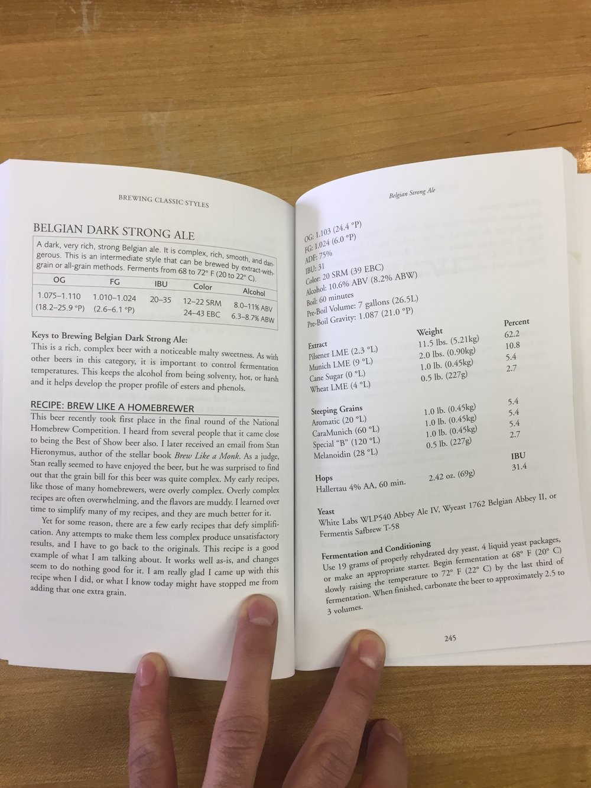
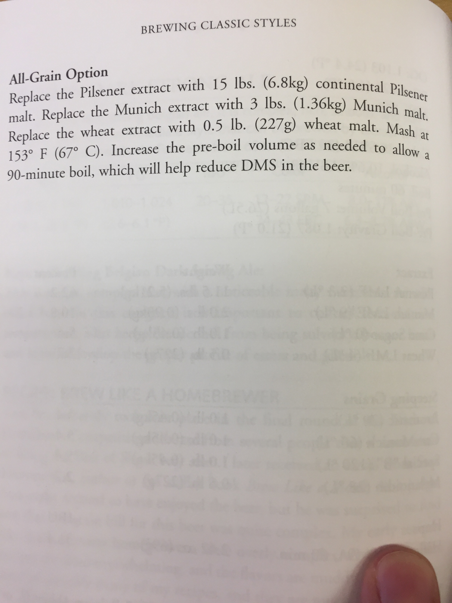
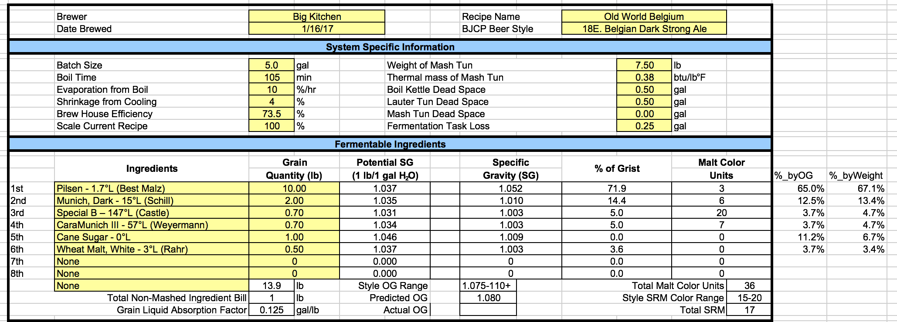
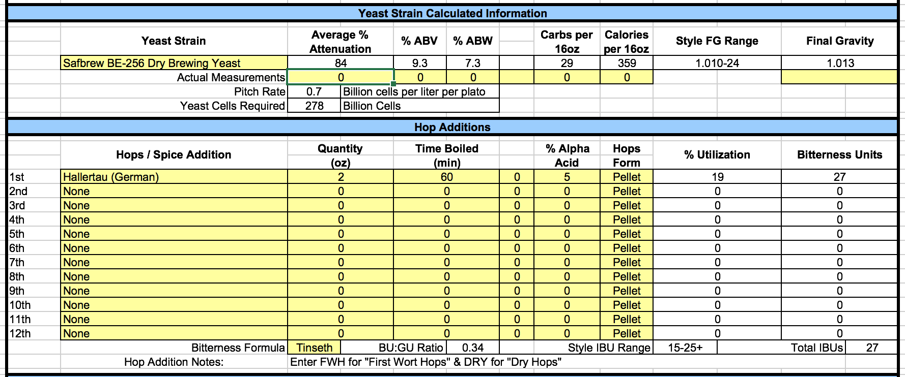
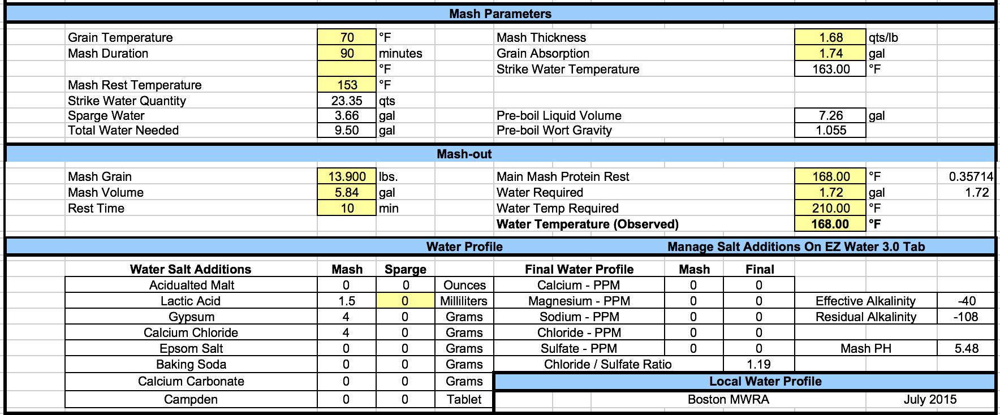
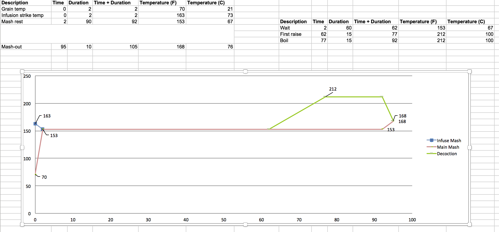

body {background-color: #FFFFFF;}---
title: "Belgian Dark Strong"
author: '- BB; KS -'
date: "January 14, 2017"
output:
  html_document:
    toc: true
    toc_depth: 2
---

```{r setup, include=FALSE}
library(rmarkdown)
library(knitr)
library(dplyr)
```

```{r results="asis", echo = FALSE}
cat("
<style>
body {background-color: #FFFFFF;}
</style>
")
```

### ADDRESSING PAST PITFALLS

In the past we used the following grain bill for an OG of 1.077.

* Pilsener - 75% - 12.6 lbs
* 45L Candi Syrup - 14% - 1.85 lbs
* Flaked Wheat - 7% - 1.18 lbs
* Light Munich - 4% - 0.7 lbs

Hops were as follows.

* Saaz - 2 oz - 20 IBU
* Hallertau - 1 oz - 7 IBU

We didn't record which yeast we used or how much we pitched, but my bet was that we used the Chimay yeast (Wyeast 1214) and pitched two packets (200 billion cells). For temperature control, we put the fermenter in a large bucket with ice water for the first couple days. We still ran into hot, solvent alcohols. We have brewed two high gravity beers since then and still have not figured out how to reduce the hot, solvent alcohols and esters. 

In *brew like* a MONK, from the chapter "Recipes: What Works" and section Pros: Tips From Judges they recommend avoiding hot higher alcohol, fusels, by pitching a proper amount of yeast and assuring proper aeration. In the "Yeast and Fermentation" chapter, they also cite that

* Higher alcohol (fusel) production by yeast is directly correlated with the amount of yeast growth during fermentation. [Larger pitch rate = less yeast growth = less fusels]. 
* Ester production by yeast is inversely related to yeast growth. [Larger pitch rate = less yeast growth = more esters]. 
* Most esters are pleasant, but there is one called ethyl acetate which is fruity and floral yet solvent. Higher pitching rates lower ethyl acetate levels. However, too high of a pitch rate can actually increase ester formation.

To follow their advice on proper pitch rates, we looked at commercial pitch rate examples cited in the same book.

* Orval uses 0.74 billion cells per liter per plato
* Rochefort 12 uses 0.65 billion cells per liter per plato
* Duvel uses 0.44 billion cells per liter per plato
* Jamil Zainasheff uses 0.62 billion cells per liter per plato (cited below from Brewing Classic Styles)

We settled on using 0.70 billion cells per liter per plato for our recipe. As far as aeration, both *brew like* a MONK and the Yeast book recommend aerating higher than the typical 8-10 ppm of oxygen for high gravity beers. In an [article by BYO](http://byo.com/malt/item/1664-yeast-strains-for-belgian-strong-ales), they cite 12-15 ppm as the proper amount. Several sources say that you can only get 8 ppm oxygen by stirring vigorously for 15 minutes when the wort has cooled. We just bought an oxygen stone and regulator so that we can achieve higher oxygen levels. The Yeast book by Chris White/Jamil Zainasheff quotes a White Labs experiment where they aerated 20L of 1.077 wort using a 0.5 micron stone at a flow rate of 1 liter per minute. With this setup, they reported 9.2 ppm oxygen from 60 seconds of pure oxygen and 14.08 ppm oxygen from 120 seconds of pure oxygen. We fit a second-order polynomial to the data from the Yeast book and determined that we can get 13 ppm oxygen from 100 seconds of pure oxygen. We have a 0.5 micron stone, but we need to check if we have control over the oxygen flow rate. Additionally, we should eliminate vigorous stirring during the wort cooling process and stir gently. This will allow us to be consistent with our oxygenation going forward.

It has been cited by many sources that fermentation temperature is also key to reducing fusel alcohols. Essentially, you just need to prevent the fermentation temperature from growing out of control (> 80F) or large swings in temperature in short periods of time. Ben's room is luckily the perfect temperature (64 F) for fermenting in this time of year (Winter). One option is to let the beer ferment in Ben's room for a week, which will allow for a natural rise in temperature in the first 72 hours. We will monitor the temperature closely using a temperature strip and react accordingly.

Another option would be to attempt using the fridge again. The basement temperature is 60F in the winter, which is troubling because the beer might not be able to climb to the right temperature. In the past we have always left the temperature probe outside of the beer, which isn't ideal. It is best to have the probe in the beer itself for the most accurate measurement. In the event that you can't get the probe in the beer, the Yeast book recommends taping some cheap insulation (several layers of bubble wrap, a folded-up cloth, or a block of Styrofoam) over the probe on the outside of the fermentor. We could attempt this as well and monitor it closely over the first 72 hours to see if we need to make any changes. 

GENERAL RECIPE DESIGN

In *brew like* a MONK, there isn't as much useful information as I thought there would be for designing the grain bill, hop bill, or mashing procedure. It seems like the information isn't super reliable for these aspects. The author makes it sound like the information comes from people or journalists that visit the brewery and ask questions to the monks. The monks themselves seem to never reveal too many details on their recipes and they frequently have to come out say "we don't do what they said we do". So I think you have to take everything reported with a grain of salt. They also don't list any malt grist percentages so there's not much useful information for designing the malt and hop bills. 

At the brew shop, the store manager showed me Brewing Classic Styles by Jamil Zainasheff. I posted the snapshot of Jamil's recipe below, which I based most of our recipe on. One thing that I am really excited about is the fact that we are not using caramelized sugar syrup in this brew. Instead, we are going to get that malt complexity from the use of Special B and CaraMunich malts. We will use pure cane sugar to get the light body and high attenuation of this style. 




## Recipe
```{r Recipe, echo= FALSE}
Recipe <- "Belgian Dark Strong"

recipe <- data.frame(
  Recipe = Recipe,
  Style = "Belgian Dark Strong",
  Date = Sys.Date(),
  OG = 1.080,
  FG = 1.01 
)

kable(recipe)
```

## Fermentables

Jamil uses cane sugar for 5.4% of the total malt weight in his recipe, shown in the picture above. *brew like* a MONK and other sources recommend using sugar for 10-20% of the malt bill. It isn't clear to me whether they mean 10-20% of the total gravity or 10-20% of the total malt weight. We are using 1 pound of sugar, which constitutes 11.2% of the total gravity and 6.7% of the total malt weight. The dark strong recipe in *brew like* a MONK calls for 7% sucrose. Since this doesn't fit inside their own recommendation, I am guessing the recipe breaks down malt percentages by weight contribution, whereas their 10-20% sugar recommendation is by gravity contribution. The malt bill for the *brew like* a MONK recipe is listed below and it compares well with Jamil's recipe.

* Belgian pale malt 62%
* Belgian Munich malt 16%
* Wheat malt 6%
* Special B 4%
* CaraMunich 3%
* CaraVienna 2%
* Sucrose 7%

Our selection of malt percentages were determined by trying to hit a target gravity of 1.080 and using evenly rounded weights. The Pilsen provides the back bone malt character. The Munich provides deeper maltiness. We further develop melanoidin via a 15 minute decoction to mash-out. The Special B provides raisin and caramel flavors, increased body, and the bulk of the dark color. The CaraMunich provides further dark color, caramel-sweet aroma, and impressions of plum and other dark fruits. The small amount of wheat malt contributes more protein to the beer, which aids in head retention.

```{r Fermentables, echo= FALSE}
fermentables <- data.frame(
  Recipe = rep(Recipe,6),
  Ingredients = c("Pilsen 1.7 L", 
                  "Munich Dark 15 L", 
                  "Special B 147 L", 
                  "CaraMunich III 57 L",
                  "Cane Sugar 0 L",
                  "Wheat Malt, White 3 L"),
  Lbs = c(10, 2, 0.7, 0.7, 1, 0.5)
)

kable(fermentables)
```



## Hops

* Hallertau (German) - 5% AA - 2 oz - 60 min boil (27 IBU)

```{r Hops, echo= FALSE}
hops <- data.frame(
  Recipe = Recipe,
  Hop = c("Hallertau"),
  Alpha_Acid = c(5),
  Weight = c(2),
  Boil_Time = c(60),
  IBU = c(27)
)

kable(hops)
```



## Mash

```{r Mash, echo= FALSE}
mash <- data.frame(
  Recipe = Recipe,
  Mash_Thickness = 1.68,
  Sacc_Rest = 153,
  Strike_Water_Temp = 163,
  Mash_Vol = 5.84,
  Sparge_Vol = 3.66
)

kable(mash)
```




## Yeast

```{r Yeast, echo= FALSE}
yeast <- data.frame(
  Recipe = Recipe,
  Yeast_Strain = "Safbrew BE-256 Dry Brewing Yeast",
  Attenuation = 84,
  Initial_Cell_Count_Billions = NA,
  Pitched_Cells_Billions = 278,
  Liters_For_Starter = NA, 
  Time_For_Starter = NA
)

kable(yeast)
```

COOLING AND AERATION

Since we are going to attempt to aerate with pure oxygen, we should minimize the amount of oxygenation that we do during cooling. This means that we should gently stir the wort when it cools and try to limit any bubbles. Since the regulator has no flow rate gauge, we are just going to have to try it and see how it goes and adjust as necessary for future batches. I will talk to the guy at the hardware store to see if there is any way to estimate flow rate. If there is no way, we will just try 90 seconds of pure oxygen. Several sources say 60 seconds will get you to the typical 8-10 ppm, so I think assuming an extra 30 seconds will get us to the right mark. 

## Fermentation

Days 1-7 : Ben's room 64F
Days 8-14 : Basement 60F (move at night so the temperature swing isn't too great)
Day 15-20 : Fridge 32F 
Day 21 : Somewhere in the house that's dark and 72F
Day 22 : Pitch 2 billion cells per liter = 38 billion cells = 2.2 grams with priming sugar and bottle
Day 36 : Drink 

```{r Fermentation, echo= FALSE}
fermentation <- data.frame(
  Recipe = Recipe,
  Temp1 = 64,  Days1 = 7,
  Temp2 = 60,  Days2 = 7,
  Temp3 = 32,  Days3 = 6,
  Temp4 = 72,  Days4 = 14

)

kable(fermentation)
```

The amount of yeast used for refermentation was decided using the following data from *brew like* a MONK.

Duvel - 1 billion cells per liter
Orval - 3 billion cells per liter
Rochefort - 1-plus billion cells per liter
Westmalle - 2 billion cells per liter
Allagash - .75-2 billion cells per liter depending on the gravity of the beer
The following is a great article on how much priming sugar to add for bottling. It depends on how attenuated your beer was and the temperatures. We will put more thought into this later when we get an idea for how the fermentation went.

https://www.homebrewersassociation.org/magazine/free-downloads/ 

Brew by the Numbers—Add Up What’s in Your Beer

