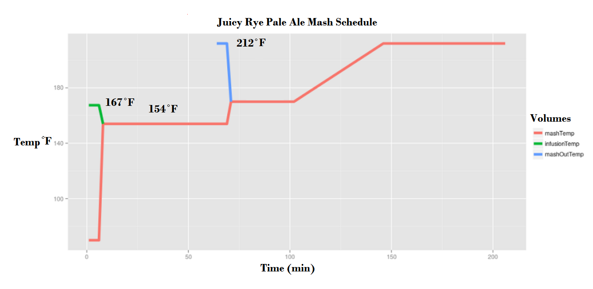

```{r setup, include=FALSE}
library(rmarkdown)
library(knitr)
library(dplyr)
```

```{r results="asis", echo = FALSE}
cat("
<style>
body {background-color: #FEF9E7;}
</style>
")
```

The Rye malt usually imposes a bread like dry spice that some describe as bitter. While normally hopped to match the bitterness created by the rye, the ale we intend to make will be mainly dry hopped. This is in order to bring a citrus fruitiness to the beer for contrast with the spice flavors of the Rye.

Research suggests that above 20% rye for the malt bill, is in excess as the flavor of rye is sharp. Brian from [Boston Homebrew Supply,](http://bostonhomebrewsupply.com/) mentioned he had once tried up to 50% rye to really get a sense of the flavor and he said it was too much. I do intend to try a 50% rye at some point just to see what it's like, but Brian said it was way too in your face with the rye. Any way for this brew we will choose 20% to make sure we can taste it, but not too much to make it offensive. 

The grain bill in general is simple to accent the affect of the rye, but does introduce some sugary malts to offset the bitterness\spice a bit.


## Recipe
```{r Recipe, echo= FALSE}
Recipe <- "Rye Pale Ale"

recipe <- data.frame(
  Recipe = Recipe,
  Style = "Rye Pale Ale",
  Date = Sys.Date(),
  OG = 1.051,
  FG = 1.018,
  ABV = 5.35
)

kable(recipe)
```

## Fermentables

Grain Characteristics Desired:

* Pale 2-row Malt (70-80%) - clean flavor and low body
* Rye (15-20%) - main flavor, dry, spicy, bread-like, bitter
* Crystal 40 - sweet, caramel, toffee
* Victory - biscuit, bread, nutty
* Carapils - head retention (small), no flavor
* The actual grain bill we decided upon is below:

```{r Fermentables, echo= FALSE}
fermentables <- data.frame(
  Recipe = rep(Recipe,5),
  Ingredients = c("Pale 2-row Malt", 
                  "Rye", 
                  "Crystal", 
                  "Victory",
                  "Carapils"),
  Lbs = c(7.95,2.98,0.51,0.49,0.24)
)

kable(fermentables)
```

## Hops

In choosing hops we wanted to aim for low cohumulone. This alpha acid is [known for harsher bitterness than either humulone or adhumulone](http://www.bjcp.org/cep/HopVarieties.pdf). We are going for fruit first, then citrus, and then floral...everything else is secondary. While most people go for IBUs in the range of 30-50, we think the rye will be plenty spicy so maybe something a little less like 30-35. Going off of our local [suppliers site](http://bostonhomebrewsupply.com/products/), we decided to go with:

* [Azacca](http://www.adha.us/varietals/azacca-adha-483) - Named for the Haitian god of agriculture, is a hop big in citrus and tropical fruit tones. It’s excellent aromatic qualities have quickly made Azacca® a go-to hop for late and dry hop additions in varying styles of beer.
* [Falconer’s Flight](https://ychhops.com/varieties/falconers-flight) - Developed by Hopunion LLC in 2010, Falconer's Flight hop pellets are an exclusive proprietary hop blend created to honor and support the legacy of Northwest brewing legend, Glen Hay Falconer. Proceeds from each Falconer's Flight purchase is contributed to the Glen Hay Falconer Foundation. These hop pellets are an excellent complement to many IPA and Pale Ale-oriented hop varieties.

As you can see we are boiling some hops but the majority (2/3) go in ~5 min before boil is over and flame out.

Summary of Hops additions:

```{r Hops, echo= FALSE}
hops <- data.frame(
  Recipe = Recipe,
  Hop = c("Azacca","Falconer's Flight","Falconer's Flight"),
  Alpha_Acid = c(15,11,11),
  Weight = c(0.5,0.5,0.5),
  Boil_Time = c(60,5,0),
  Utilization = c(26.30,5.62,0),
  IBU = c(26.96,3.94,0)
)

kable(hops)
```

## Mash

```{r Mash, echo= FALSE}
mash <- data.frame(
  Recipe = Recipe,
  Mash_Thickness = 1.25,
  Sacc_Rest = 154,
  Strike_Water_Temp = 167,
  Mash_Vol = 3.803125,
  Sparge_Vol = 4.2 # I totally made this up
)

kable(mash)
```



## Yeast

Starter - liters at SG: (1.050) from dissolved extract (preferable) or corn sugar.

```{r Yeast, echo= FALSE}
yeast <- data.frame(
  Recipe = Recipe,
  Yeast_Strain = "WLP060 - White Labs American Ale",
  Attenuation = 76,
  Initial_Cell_Count_Billions = 100,
  Pitched_Cells_Billions = 182.15,
  Liters_For_Starter = 0.823, 
  Time_For_Starter = 1 #Day
)

kable(yeast)
```

COOLING AND AERATION

Since we are going to attempt to aerate with pure oxygen, we should minimize the amount of oxygenation that we do during cooling. This means that we should gently stir the wort when it cools and try to limit any bubbles. Since the regulator has no flow rate gauge, we are just going to have to try it and see how it goes and adjust as necessary for future batches. I will talk to the guy at the hardware store to see if there is any way to estimate flow rate. If there is no way, we will just try 90 seconds of pure oxygen. Several sources say 60 seconds will get you to the typical 8-10 ppm, so I think assuming an extra 30 seconds will get us to the right mark. 

## Fermentation

```{r Fermentation, echo= FALSE}
fermentation <- data.frame(
  Recipe = Recipe,
  Temp1 = 69,  Days1 = 7,
  Temp2 = 73,  Days2 = 7,
  Temp3 = 65,  Days3 = 14
)

kable(fermentation)
```


