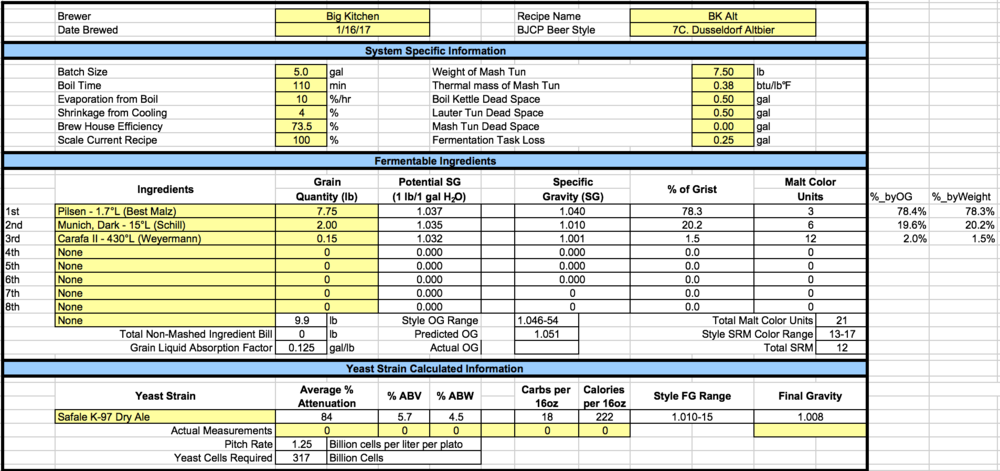
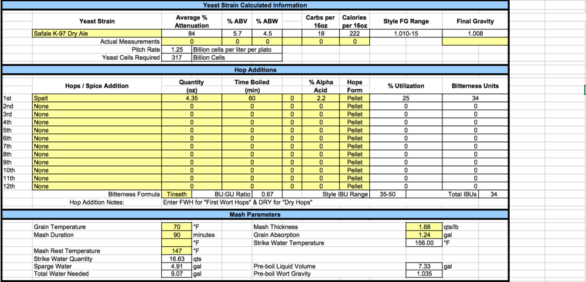
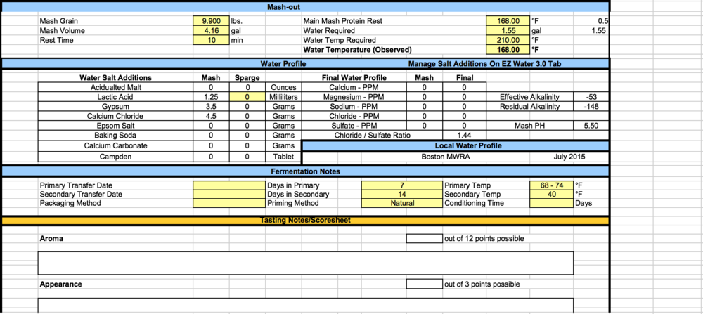

```{r setup, include=FALSE}
library(rmarkdown)
library(knitr)
library(dplyr)
print(getwd())
```

```{r results="asis", echo = FALSE}
cat("
<style>
body {background-color: #FFFFFF;}
</style>
")
```

Data collected by Roy Daniels (Designing Great Beers) about German breweries in Dusseldorf:

* OG = 1.047
* FG = 1.008 - 1.010
* BU = 33-48, but closer to 33
* BU:GU = [min .56, avg .70, max 1.00]

Style notes from Daniels:

* High attentuation, similar to Kolsch
* Hop bitterness only, no hop aroma, very little hop flavor
* Deep, copper color achieved through specialty malts, namely black malt

Note: Diebels Alt uses 10% munich, 90% pilsener

2nd round NHC contestants all used crystal malts but if you want to be authentic, try it without them. Average grain bill from NHC below. Note: very similar to recipe found in Brewing Classic Styles, which we've used as a reference before.

* Pilsen - 75%
* Munich - 19%
* CaraMunich - 5%
* Carafa - 1%

## Recipe
```{r Recipe, echo= FALSE}
Recipe = 'Altbier1'

recipe <- data.frame(
  Recipe = Recipe,
  Style = "Altbier",
  Date = "02.20.2017",
  OG = 1.051,
  FG = 1.008 
)

kable(recipe)
```

## Fermentables
```{r Fermentables, echo= FALSE}
fermentables <- data.frame(
  Recipe = rep(Recipe,3),
  Ingredients = c("Pilzen 1.7 L","Munich Dark 15 L","Carafa II 430 L"),
  Lbs = c(7.75, 2.0, 0.15)
)

kable(fermentables)
```



#Hops

Spalt hops is what all the commercial brewers use in Dusseldorf and Daniels highly recommends it for the style. We have used it before in a Kolsch and I loved it.

```{r Hops, echo= FALSE}
hops <- data.frame(
  Recipe = Recipe,
  Hop = c("Spalt"),
  Weight = c(4.35),
  Boil_Time = c(60),
  IBU = c(34)
)

kable(hops)
```

# Mash

Mash around 145-149 to achieve a high attenuation.

```{r Mash, echo= FALSE}
mash <- data.frame(
  Recipe = Recipe,
  Mash_Thickness = 1.68,
  Sacc_Rest = 147,
  Mash_Duration = 90,
  Strike_Water_Temp = 156,
  Mash_Vol = 4.16,
  Sparge_Vol = 4.91
)

kable(mash)
```

# Yeast

```{r Yeast, echo= FALSE}
yeast <- data.frame(
  Recipe = Recipe,
  Yeast_Strain = "Safale K-97 Dry Ale",
  Attenuation = 84,
  Initial_Cell_Count_Billions = NA,
  Pitched_Cells_Billions = 317,
  Liters_For_Starter = NA,
  Time_For_Starter = NA
)

kable(yeast)
```



# Fermentation

We are a bit rushed for time, so we are gonna try to keep fermentation within 5-6 weeks.

```{r Fermentation, echo= FALSE}
fermentation <- data.frame(
  Recipe = Recipe,
  Temp1 = 64, Days1 = 7,
  Temp2 = 72, Days2 = 1,
  Temp3 = 64, Days3 = 6,
  Temp4 = 60, Days4 = 1,
  Temp5 = 55, Days5 = 1,
  Temp6 = 50, Days6 = 1,
  Temp7 = 44, Days7 = 10,
  Temp8 = 50, Days8 = 1,
  Temp9 = 55, Days9 = 1,
  Temp10 = 60, Days10 = 1,
  Temp11 = 64, Days11 = 1,
  Temp12 = 68, Days12 = 1
)

kable(fermentation)
```

Note: Bottle at room temp for 2 weeks and serve

# Water Chemistry



Final Thoughts:
 
In the end we made some modifications based off gut instincts. Below is the recipe used. Brew day went very well and everything went according to plan. 


