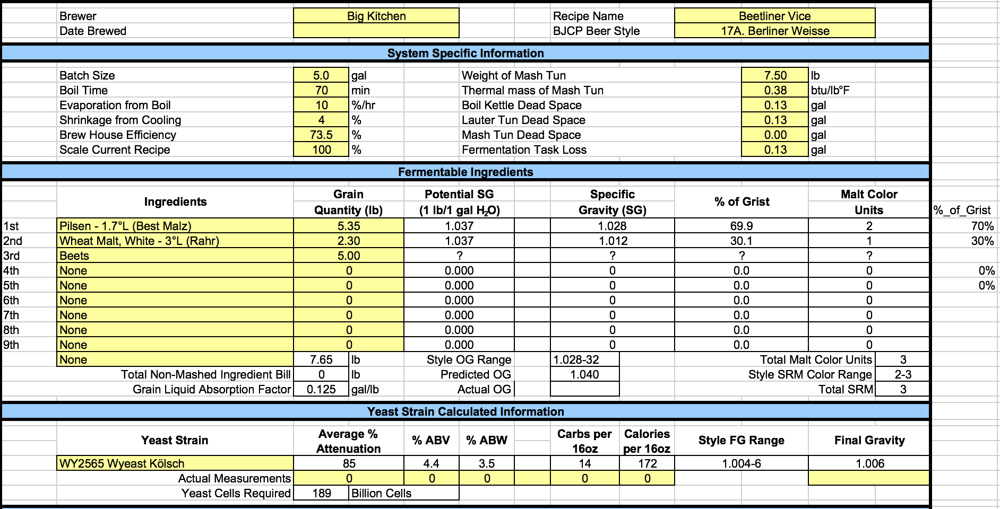
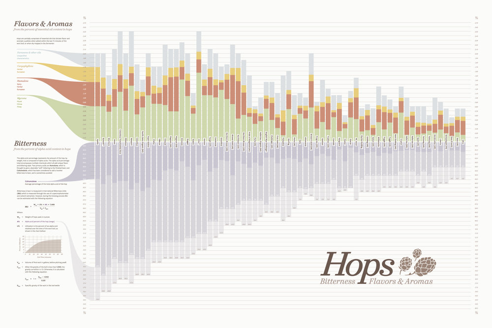
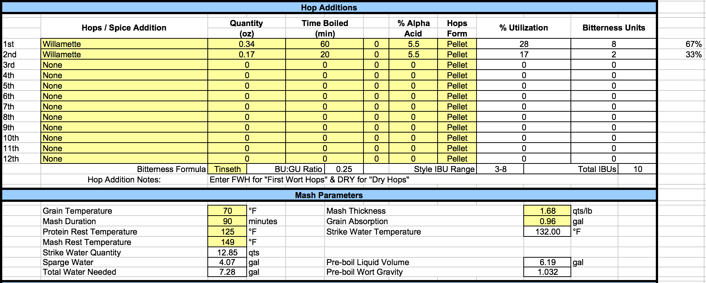
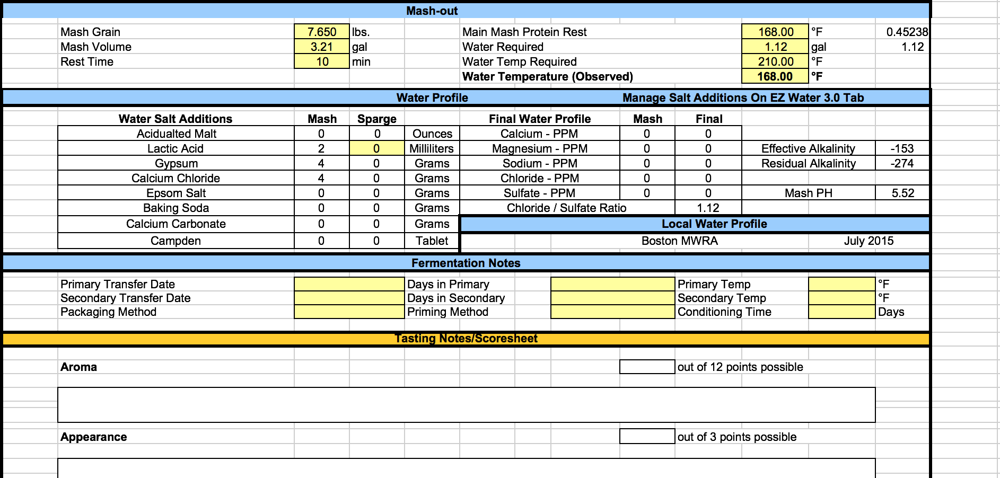

```{r setup, include=FALSE}
library(rmarkdown)
library(knitr)
library(dplyr)
print(getwd())
```

```{r results="asis", echo = FALSE}
cat("
<style>
body {background-color: #FEF9E7;}
</style>
")
```

## Recipe
```{r Recipe, echo= FALSE}
Recipe <- "Beetliner Weisse"

recipe <- data.frame(
  Recipe = Recipe,
  Style = "Berliner Weisse",
  Date = Sys.Date(),
  OG = 1.040,
  FG = 1.005 
)

kable(recipe)
```

## Fermentables

* Wheat Malt - 30%
* Pilsen Malt - 70%
* Rice Hulls
* 5 lbs beets (i.e., 15 small beets)

```{r Fermentables, echo= FALSE}
fermentables <- data.frame(
  Recipe = rep(Recipe,4),
  Ingredients = c("Pilsen Malt", "Wheat Malt", "Rice Hulls", "Beets"),
  Lbs = c(5.35, 2.3,NA, 5)
)

kable(fermentables)
```



## Hops


As for hops, I would recommend that home brewers stay away from any high alpha variety (such as Simcoe, Chinook and the likes) and any hop with extremely identifiable characteristics (like Cascade and Amarillo). I use Tettnanger almost exclusively. Also, using whole, aged hops that are well past the “organic rot” aroma stage can also make a big impact. It takes planning to make one of these sour gems.

A brewer can do one of two things depending on time: Put hops into a breathable container somewhere out of the way for two years, or bake them at very low temperatures (200 ºF or 93 ºC) for several hours (at least 4–6). Personally, I like to let nature run its course. This will give your beer the aged-hop flavor I find preferable in my sour beer.

Using the following chart (http://zekeshore.com/hops_v1.12.png), we were looking for hops with moderate levels of alpha acid and high percentage of Myrcene (Floral, Citrus, Piney). Top contenders at the moment are Brewer’s Gold, Willamette, and Crystal. Ben’s words -> “ok lower bitterness, high citrus, and low herbal earthy flavor?”. Kyle’s words -> “yea”.



```{r Hops, echo= FALSE}
hops <- data.frame(
  Recipe = rep(Recipe,2),
  Hop = c("Willamette"),
  Weight = c(0.34,0.17),
  Boil_Time = c(60,20),
  IBU = c(8,2)
)

kable(hops)
```

## Mash

Following instructions come from recommendations made by Five Blades Brewing's [introduction to sour mashing](https://www.fivebladesbrewing.com/intro-to-sour-mashing/) (with a few modifications).

Mash as usual. This is exactly the same as every other mash you have done, mash high or low as your recipe requires. I have heard folks say they have had better success with souring when using a thinner mash, but the reports are anecdotal.
Lower pH of wort to ~4.5. I recommend using food-grade lactic acid. Its helpful to have a pH meter for this, but otherwise I find adding 10-15 ml (2-3 tsp) of lactic acid after mashing to get me down to that range.
Cool your mash (or wort) to ~110ºF.
Pitch a hop bag containing 2 cups of pilsen malt (source of Lactobacillus).
Cover surface of mash/wort with plastic wrap and purge with carbon dioxide (not super necessary, but can achieve this by pouring small layer of carbonated water into beer).
Place in a warm and insulated place. I place my souring mash in my fermentation fridge (off) for insulation and keep the mash warm by using a [reptile heater pad](https://www.amazon.com/gp/product/B0002AQCL4/ref=as_li_tl?ie=UTF8&camp=1789&creative=390957&creativeASIN=B0002AQCL4&linkCode=as2&tag=birdingninja-20&linkId=KD3LQQCUIAKX4GWM).
Once a day or so take a sample, but try not to let much oxygen in. Temperature should be between 100ºF – 110ºF. Check the pH if you have a meter or taste the sample for desired sourness. It usually takes 2-4 days to get down to a pH of ~3.3-3.5.
Note: While a starting pH of 4.5 will typically eliminate the risk of food poisoning, use caution when tasting the results of a sour mash. Only a low pH and the presence of alcohol can guarantee your fermented product is safe to drink.
Evaluate your sour mash. It may look and smell a little gross/funky, this is fine (my first sour mash smelled like tomato soup). A good sour mesh smells cleanly sour, if it smells a lot like vomit or makes you want to vomit, you may not want to continue. Some off-flavor will boil out or be scrubbed by fermentation.
Boil the wort. This will sterilize the wort, making your ferment “clean.” Everything from here on requires your standard cold-side process.

We followed this process to the T and cut the souring off right on day 3.

```{r Mash, echo= FALSE}
mash <- data.frame(
  Recipe = "Recipe1",
  Mash_Thickness = 1.68,
  Strike_Water_Temp = 132,
  Protein_Rest_Temp = 125,
  Sacc_Rest_Temp = 149,
  Mash_Vol = 3.21,
  Sparge_Vol = 4.07
)

kable(mash)
```



## Yeast

I think we want something fruity. I’ve read that kolsch/german ale yeast works really nice. I wonder how a california common yeast would work? That could be a cool way to add an “american twist” to this beer!.


```{r Yeast, echo= FALSE}
yeast <- data.frame(
  Recipe = Recipe,
  Yeast_Strain = "WY2565 Wyeast Kolsh",
  Attenuation = 85,
  Initial_Cell_Count_Billions = NA,
  Pitched_Cells_Billions = 189,
  Liters_For_Starter = NA,
  Time_For_Starter = NA
)

kable(yeast)
```

## Fermentation

We followed a slow version of a typical K-97 fermentation schedule because of holidays/travelling/laziness.

* 64 F - 7 days
* 72 F - 1 day
* 64 F - 5 weeks
* 60 F - 1 day
* 56 F - 1 day
* 52 F - 1 day
* 48 F - 1 day
* 44 F - 4 weeks
* 48 F - 1 day
* 52 F - 1 day
* 56 F - 1 day
* 60 F - 1 day
* 64 F - 1 day
* 68 F - 1 day

Bottle at room temp for 2 weeks and serve

```{r Fermentation, echo= FALSE}
fermentation <- data.frame(
  Recipe = Recipe,
  Temp1 = 64, Days1 = 7,
  Temp2 = 72, Days2 = 1,
  Temp3 = 64, Days3 = 35,
  Temp4 = 60, Days4 = 1,
  Temp5 = 56, Days5 = 1,
  Temp6 = 52, Days6 = 1,
  Temp7 = 48, Days7 = 1,
  Temp8 = 44, Days8 = 28,
  Temp9 = 48, Days9 = 1,
  Temp10 = 52, Days10 = 1,
  Temp11 = 56, Days11 = 1,
  Temp12 = 60, Days12 = 1,
  Temp13 = 64, Days13 = 1,
  Temp14 = 68, Days14 = 1
)


kable(fermentation)
```

The beer turned out phenomenal. Will definitely do this again. If there would be anything to change it would be trying to figure out how to make the beet color shine through. However, the current color is a glowing orange which must be the residue leftover from the beets. Ben's idea is to add the beet "juice" (roast + boil) after fermentation, so that the yeast don't "eat it". We might try this next time.

# Sources

http://www.bjcp.org/2008styles/style17.php#1a

http://www.germanbeerinstitute.com/Berliner_Weisse.html

https://www.fivebladesbrewing.com/lactobacillus-starter-guide/

(Note below: 2 mL lactic acid was used to get mash pH down to 5.5. Need to add additional teaspoons as recommended above to get < 4.5.)


