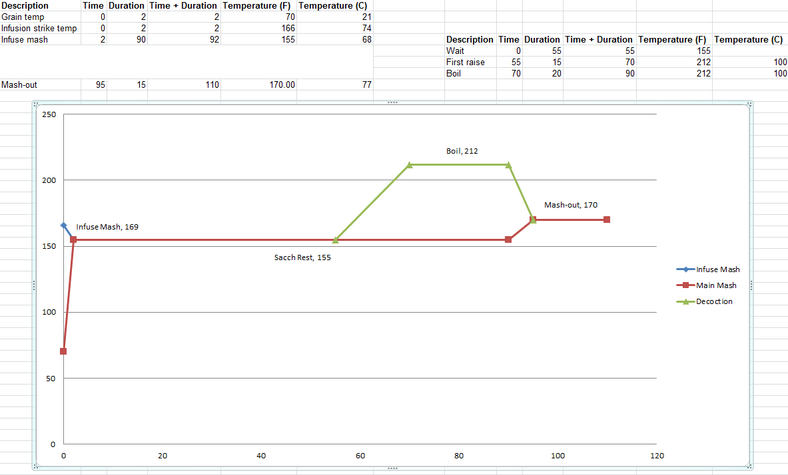

```{r setup, include=FALSE}
library(rmarkdown)
library(knitr)
library(dplyr)
```

```{r results="asis", echo = FALSE}
cat("
<style>
body {background-color: #FFFFFF;}
</style>
")
```

## Constants

* Evaporation rate = 5%
* Boil time = 90 minutes
* Efficiency = 73.5%
* Boil kettle dead space = 0.5 gallons
* Lauter tun dead space = 0.25 gallons
* Fermentation loss = 0.25 gallons

## Recipe
```{r Recipe, echo= FALSE}
Recipe <- "Bock"

recipe <- data.frame(
  Recipe = Recipe,
  Style = "Bock",
  Date = Sys.Date(),
  OG = 1.050,
  FG = 1.010 
)

kable(recipe)
```

## Fermentables

* Munich, 8°L (Avangard Malz) - 13.03 lbs (87.3%)
* Pilsen, 2°L (Avangard Malz) - 1.42 lbs (9.5%)
* CaraMunich III, 60°L (Franco Belges) - 0.23 lbs (1.5%)
* Carafa II, 430°L (Weyermann) - 0.25 lbs (1.7%)

```{r Fermentables, echo= FALSE}
fermentables <- data.frame(
  Recipe = rep(Recipe,4),
  Ingredients = c("Munich 8 L", "Pilsen 2 L", "CaraMunich III 60 L", "Carafa II 430 L"),
  Lbs = c(13.03, 1.42, 0.23, 0.25)
)

kable(fermentables)
```

## Hops

* Hallertau (German) - 3.2% AA - 1 oz - 60 min boil (10 IBU)
* Tettnanger (German) - 3.9% AA - 1 oz - 60 min boil (12 IBU)

```{r Hops, echo= FALSE}
hops <- data.frame(
  Recipe = rep(Recipe,2),
  Hop = c("Hallertau","Tettnanger"),
  Alpha_Acid = c(3.2,3.9),
  Weight = c(1,1),
  Boil_Time = c(60,60),
  IBU = c(10,12)
)

kable(hops)
```

## Mash


```{r Mash, echo= FALSE}
mash <- data.frame(
  Recipe = Recipe,
  Mash_Thickness = 1.25,
  Sacc_Rest = 155,
  Strike_Water_Temp = 169,
  Mash_Vol = 4.67,
  Sparge_Vol = 3.59
)

kable(mash)
```



## Yeast

* Saflager W-34/70, 2.68 packs = 536 billion cells 
* Rehydrated first in 55F sink water for 30 minutes before pitching
* Yeast pitched at 55F

```{r Yeast, echo= FALSE}
yeast <- data.frame(
  Recipe = Recipe,
  Yeast_Strain = "Saflager W-34/70",
  Attenuation = 83,
  Initial_Cell_Count_Billions = NA,
  Pitched_Cells_Billions = 536,
  Liters_For_Starter = NA,
  Time_For_Starter = NA
)

kable(yeast)
```

## Fermentation

See note on fermentation fridge settings. Temperatures reported below are indicative of the fridge's set temperature, which does not truly indicate what the actual fridge temperature will be. This is because of the fact that temperature swings drastically below the set temp.

* 57F for 3 days
* 70F for 2 days
* 64F
* 57F for 3 days - then rack to secondary
* 50F
* 42F for 4 weeks 
* 50F
* 57F - bottle on 05/27
* 60F - carbonate for 2 weeks
* 36F - cold crash 

```{r Fermentation, echo= FALSE}
fermentation <- data.frame(
  Recipe = "Recipe1",
  Temp1 = 57,  Days1 = 3,
  Temp2 = 70,  Days2 = 2,
  Temp3 = 64,  Days3 = 1,
  Temp4 = 57,  Days4 = 3,
  Temp5 = 50,  Days5 = 1,
  Temp5 = 42,  Days5 = 28,
  Temp5 = 50,  Days5 = 1,
  Temp5 = 57,  Days5 = 1,
  Temp5 = 60,  Days5 = 14,
  Temp5 = 36,  Days5 = 1
)

kable(fermentation)
```


Notes:

* Use mash infusion equation from How To Brew and decoction volume equation from Braukaiser (which is a reworked formula Palmer's How To Brew equation)
* Did not increase by 20% as Braukaiser recommended because we use boiling kettle as mash tun and could use heat if necessary
* We ended up with only 4 gallons of wort at 1.080 OG. Here are some possible reasons
    + Did not include extra 20 minute boil time for decoction in water vol calc
    + Evaporation rate may be larger than we realize (based off quick calculations, maybe go from 5% to 15% next batch)
* We added water until OG read 1.068 (about 5.5 gallons total). This suggests that we also undershot our efficiency. Consider bumping efficiency factor from 73.5% to 75% in future brews
* We made rough estimates of dead space volumes
    + Lauter dead = 0.125 gallons
    + Kettle dead = 0.125 gallons
    + Ferm dead = 0.125 gallons 
* Brewed this in spring so we got the infusion chiller to bring the wort down to a perfect 55 F!
* Set fermentation fridge to 57 because the temperature swings roughly between (57-6) to (57+1), which averages out to 54.5 F
* Received advice from Boston Homebrew Supply to do Diacetyl Rest after a couple days after pitching the yeast, so we're going to try that. The guy said that in the past, when he would wait a week or two to do it, that they weren't cleaning up their diacetyl as much as he wanted.
