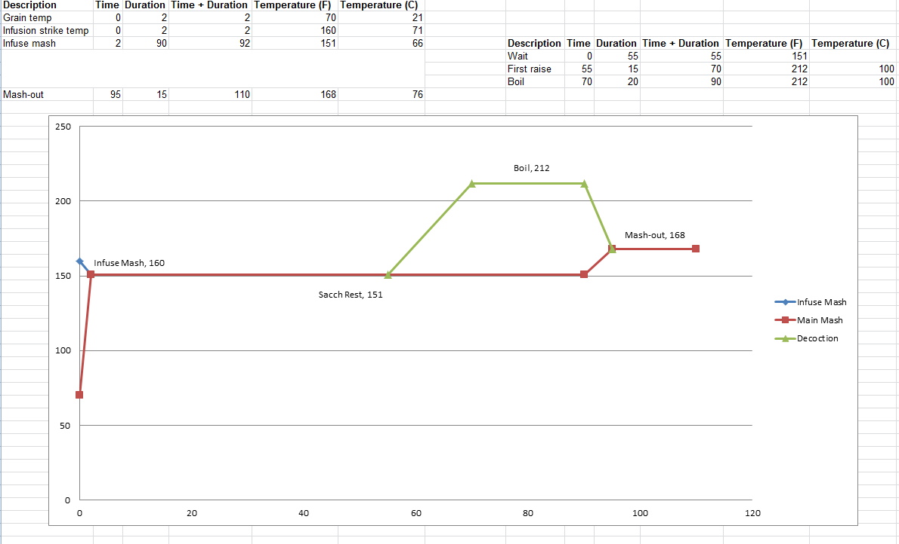

```{r setup, include=FALSE}
library(rmarkdown)
library(knitr)
library(dplyr)
```

```{r results="asis", echo = FALSE}
cat("
<style>
body {background-color: #FEF9E7;}
</style>
")
```

# Tasting Notes

Overall Impression - Lighter body than desired. Maltiness is on-point. Balance between sweetness, hop bitterness, and roast character is as-desired. Maybe a bit more sweetness? Definitely needs more carbonation, which is probably due to the yeast not being as active.

* Very dark brown in color. Hazy and thick (in a good way). Tan-colored head.
* Chocolate aroma, rich and Munich-like
* Moderate richness and Munich-like maltiness in flavor
* Bitter-chocolate palate that lasts into finish
* Light noble hop flavor and bitterness
* Clean lager character
* Finishing flavor features hop and roasted character
* Medium-light body. Light on carbonation, needs more.

## Recipe
```{r Recipe, echo= FALSE}
Recipe <- "Schwarzbier"

recipe <- data.frame(
  Recipe = Recipe,
  Style = "Schwarzbier",
  Date = Sys.Date(),
  OG = 1.050,
  FG = 1.010 
)

kable(recipe)
```

## Fermentables

* Pilsen, 2° (Avangard Malz) - 7.75 lbs. (72%)
* Dark Munich, 10°L (Avangard Malz) - 2.25 lbs. (21%)
* CaraMunich, 60°L (Franco Belges) - 0.33 lbs. (3%)
* Carafa II, 430°L (Weyermann) - 0.5 lbs. (5%)

```{r Fermentables, echo= FALSE}
fermentables <- data.frame(
  Recipe = rep(Recipe,4),
  Ingredients = c("Pilsen 2 L", "Dark Munich 10 L", "Caramunich 60 L", "Carafa II 430L"),
  Lbs = c(7.75, 2.25, 0.33, 0.5)
)

kable(fermentables)
```

## Hops

* Mangum (German) - 0.4 oz - 60 min boil - 18 IBU
* Tettnanger (German) - 0.9 oz - 20 min boil - 9 IBU

```{r Hops, echo= FALSE}
hops <- data.frame(
  Recipe = rep(Recipe,2),
  Hop = c("Magnum", "Tettnanger"),
  Weight = c(0.4, 0.9),
  Boil_Time = c(60, 20),
  IBU = c(18, 9)
)

kable(hops)
```

## Mash

* Infusion water to 151 F sacch. rest = 4.74 gallons @ 160 F
    + Add 4.5 g Gypsum (CaSO4)
    + Add 4 g Calcium Chloride (CaCl2)
    + Add a drop of Lactic Acid (e.g., < 1 mL)
* Decoction mash volume = 1.52 gallons
* Sparge volume = 3.87 gallons

```{r Mash, echo= FALSE}
mash <- data.frame(
  Recipe = Recipe,
  Mash_Thickness = 1.750693,
  Sacc_Rest = 151,
  Infusion_Temp = 160,
  Mash_Vol = 4.74,
  Sparge_Vol = 3.87
)

kable(mash)
```



## Yeast

* Saflager W-34/70, two packs = 400 billion cells 
* Rehydrated first in 55 F sink water for 30 minutes before pitching

```{r Yeast, echo= FALSE}
yeast <- data.frame(
  Recipe = Recipe,
  Yeast_Strain = "Saflager W-34/70",
  Attenuation = 83,
  Initial_Cell_Count_Billions = NA,
  Pitched_Cells_Billions = 400,
  Liters_For_Starter = NA,
  Time_For_Starter = NA
)

kable(yeast)
```

## Fermentation

See note on fermentation fridge settings. Temperatures reported below are indicative of the fridge's set temperature, which does not truly indicate what the actual fridge temperature will be. This is because of the fact that temperature swings drastically below the set temp.

* 58F for 3 days
* 70F for 2 days
* 64F
* 58F for 3 days - then rack to secondary
* 50F
* 42F for 2 weeks 
* 50F
* 58F - bottle on 01/09
* 60F - carbonate for 2 weeks
* 36F - cold crash until party (02/06)

```{r Fermentation, echo= FALSE}
fermentation <- data.frame(
  Recipe = Recipe,
  Temp1 = 58,  Days1 = 3,
  Temp2 = 70,  Days2 = 2,
  Temp3 = 64,  Days3 = 1,
  Temp4 = 58,  Days4 = 3,
  Temp5 = 50,  Days5 = 1,
  Temp6 = 42,  Days6 = 14,
  Temp7 = 50,  Days7 = 1,
  Temp8 = 58,  Days8 = 1,
  Temp9 = 60,  Days9 = 14,
  Temp10 = 36,  Days10 = 36
)

kable(fermentation)
```

Notes: 

* Use mash infusion equation from How To Brew and decoction volume equation from Braukaiser (which is a reworked formula Palmer's How To Brew equation)
* Did not increase by 20% as Braukaiser recommended because we use boiling kettle as mash tun and could use heat if necessary
* Hit all temperature rests perfectly. This process is good to go for the future. 
* Brewed this in winter so we got the infusion chiller to bring the wort down to a perfect 55 F!
* Set fermentation fridge to 58 because the temperature swings roughly between (58-6) to (58+1), which averages out to 55.5 F
* Received advice from Boston Homebrew Supply to do Diacetyl Rest after a couple days after pitching the yeast, so we're going to try that. The guy said that in the past, when he would wait a week or two to do it, that they weren't cleaning up their diacetyl as much as he wanted.
*  Using a pitch rate of 1.5 billion cells/Liter/°Plato, we wanted to pitch 383 billion cells. The guy at the homebrew store said "don't worry about the extra 20 billion cells, just pitch the whole 2 packs". So we did! 
